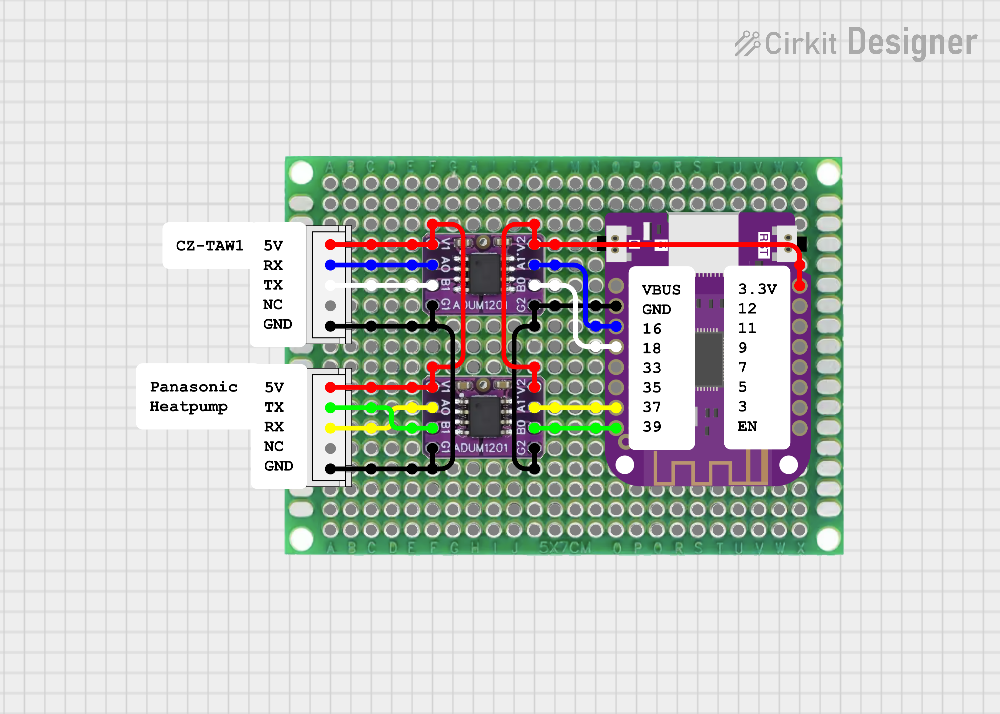

# ESPHome Panasonic Heatpump Component

## Usage

### What you need

* ESPHome compatible microcontroller (e.g. ESP8266, ESP32, ESP32-S2, ESP32-C3, ...)
* ADUM1201 Dual Channel Digital Magnetic Isolator  
  (to convert 5V UART signal from the heatpump to 3.3V UART signal of the ESP controller)
* CN-CNT cable/connectors to Heatpump/CZ-TAW1 (see [Heishamon](https://github.com/Egyras/HeishaMon) github site for more information)
  * For example: [S05B-XASK-1 JST Connector](https://a.aliexpress.com/_EvkmGVo)
  * For example: [XAP-05V-1 5Pin Cable with Female to Female Connector](https://a.aliexpress.com/_ExPT82E)

### Wiring



### CN-CNT Pinout (from top to bottom)

pin | function
----|---------
1   | +5V (250mA)
2   | 0-5V TX (from heatpump)
3   | 0-5V RX (to heatpump)
4   | NC (not connected)
5   | GND

## ESPHome example yaml code

```yaml
substitutions:
  pin_rx_hp: GPIO37  # heatpump reads data (RX) on this pin    (yellow)
  pin_tx_hp: GPIO39  # heatpump sends data (TX) on this pin    (green)
  pin_tx_wm: GPIO18  # WiFi module sends data (TX) on this pin (white)
  pin_rx_wm: GPIO16  # WiFi module reads data (RX) on this pin (blue)

external_components:
  - source:
      type: git
      url: https://github.com/ElVit/esphome_components/
    components: [ panasonic_heatpump ]

uart:
  - id: uart_heatpump
    tx_pin: $pin_rx_hp
    rx_pin: $pin_tx_hp
    baud_rate: 9600
    data_bits: 8
    parity: EVEN
    stop_bits: 1
  - id: uart_cz_taw1
    tx_pin: $pin_rx_wm
    rx_pin: $pin_tx_wm
    baud_rate: 9600
    data_bits: 8
    parity: EVEN
    stop_bits: 1

panasonic_heatpump:
  id: my_heatpump
  uart_id: uart_heatpump
  uart_client_id: uart_cz_taw1
  log_uart_msg: true
  update_interval: 5s

sensor:
  - platform: panasonic_heatpump
    top1:
      name: "Pump Flow"

binary_sensor:
  - platform: panasonic_heatpump
    top0:
      name: "Heatpump State"

text_sensor:
  - platform: panasonic_heatpump
    top4:
      name: "Operating Mode State"

number:
  - platform: panasonic_heatpump
    set5:
      name: "Set Z1 Heat Request Temperature"
      min_value: -5.0
      max_value: 5.0
      step: 1.0

select:
  - platform: panasonic_heatpump
    cool_mode: true
    set2:
      name: "Set Holiday Mode"

switch:
  - platform: panasonic_heatpump
    set1:
      name: "Set Heatpump"

climate:
  - platform: panasonic_heatpump
    cool_mode: true
    tank:
      name: "DHW"
      min_temperature: -5.0
      max_temperature: 5.0
      temperature_step: 0.5
```

## Configuration variables

- **id** (*Optional*, ID): Manually specify the ID used for actions.
- **update_interval** (*Optional*, Time): The interval of the polling request message to get the heatpump values. This time applies only if no `uart_client_id` is set. Defaults to 3s.
- **uart_id** (Optional, ID): Manually specify the UART ID of the Heatpump. Required if multiple UART buses are defined.
- **uart_client_id** (*Optional*, ID): Manually specify the UART ID of an additonal UART client like the Panasonic CZ-TAW1. If this ID is not set then your ESP controller will send the polling request messages.
- **log_uart_msg** (*Optional*, boolean): Shows the raw UART messages in the logs, if set to `true`. The messages will be written to the log level `INFO`. Defaults to false.

### Sensors

All sensors are optional and all default sensor variables can be applied.  
Here a list of all supported sensors:

```yaml
sensor:
  - platform: panasonic_heatpump
    top1:
      name: "Pump Flow"
    top5:
      name: "Main Inlet Temp"
    top6:
      name: "Main Outlet Temp"
    top7:
      name: "Main Target Temp"
    top8:
      name: "Compressor Freq"
    top9:
      name: "DHW Target Temp"
    top10:
      name: "DHW Temp"
    top11:
      name: "Operations Hours"
    top12:
      name: "Operations Counter"
    top14:
      name: "Outside Temp"
    top15:
      name: "Heat Power Production"
    top16:
      name: "Heat Power Consumption"
    top21:
      name: "Outside Pipe Temp"
    top22:
      name: "DHW Heat Delta"
    top23:
      name: "Heat Delta"
    top24:
      name: "Cool Delta"
    top25:
      name: "DHW Holiday Shift Temp"
    top27:
      name: "Z1 Heat Request Temp"
    top28:
      name: "Z1 Cool Request Temp"
    top29:
      name: "Z1 Heat Curve Target High Temp"
    top30:
      name: "Z1 Heat Curve Target Low Temp"
    top31:
      name: "Z1 Heat Curve Outside High Temp"
    top32:
      name: "Z1 Heat Curve Outside Low Temp"
    top33:
      name: "Room Thermostat Temp"
    top34:
      name: "Z2 Heat Request Temp"
    top35:
      name: "Z2 Cool Request Temp"
    top36:
      name: "Z1 Water Temp"
    top37:
      name: "Z2 Water Temp"
    top38:
      name: "Cool Power Production"
    top39:
      name: "Cool Power Consumption"
    top40:
      name: "DHW Power Production"
    top41:
      name: "DHW Power Consumption"
    top42:
      name: "Z1 Water Target Temp"
    top43:
      name: "Z2 Water Target Temp"
    top45:
      name: "Room Holiday Shift Temp"
    top46:
      name: "Buffer Temp"
    top47:
      name: "Solar Temp"
    top48:
      name: "Pool Temp"
    top49:
      name: "Main Hex Outlet Temp"
    top50:
      name: "Discharge Temp"
    top51:
      name: "Inside Pipe Temp"
    top52:
      name: "Defrost Temp"
    top53:
      name: "Eva Outlet Temp"
    top54:
      name: "Bypass Outlet Temp"
    top55:
      name: "Ipm Temp"
    top56:
      name: "Z1 Temp"
    top57:
      name: "Z2 Temp"
    top62:
      name: "Fan1 Motor Speed"
    top63:
      name: "Fan2 Motor Speed"
    top64:
      name: "High Pressure"
    top65:
      name: "Pump Speed"
    top66:
      name: "Low Pressure"
    top67:
      name: "Compressor Current"
    top70:
      name: "Sterilization Temp"
    top71:
      name: "Sterilization Max Time"
    top72:
      name: "Z1 Cool Curve Target High Temp"
    top73:
      name: "Z1 Cool Curve Target Low Temp"
    top74:
      name: "Z1 Cool Curve Outside High Temp"
    top75:
      name: "Z1 Cool Curve Outside Low Temp"
    top77:
      name: "Heating Off Outdoor Temp"
    top78:
      name: "Heater On Outdoor Temp"
    top79:
      name: "Heat To Cool Temp"
    top80:
      name: "Cool To Heat Temp"
    top82:
      name: "Z2 Heat Curve Target High Temp"
    top83:
      name: "Z2 Heat Curve Target Low Temp"
    top84:
      name: "Z2 Heat Curve Outside High Temp"
    top85:
      name: "Z2 Heat Curve Outside Low Temp"
    top86:
      name: "Z2 Cool Curve Target High Temp"
    top87:
      name: "Z2 Cool Curve Target Low Temp"
    top88:
      name: "Z2 Cool Curve Outside High Temp"
    top89:
      name: "Z2 Cool Curve Outside Low Temp"
    top90:
      name: "Room Heater Operations Hours"
    top91:
      name: "DHW Heater Operations Hours"
    top93:
      name: "Pump Duty"
    top95:
      name: "Max Pump Duty"
    top96:
      name: "Heater Delay Time"
    top97:
      name: "Heater Start Delta"
    top98:
      name: "Heater Stop Delta"
    top102:
      name: "Solar On Delta"
    top103:
      name: "Solar Off Delta"
    top104:
      name: "Solar Frost Protection"
    top105:
      name: "Solar High Limit"
    top113:
      name: "Buffer Tank Delta"
    top115:
      name: "Water Pressure"
    top116:
      name: "Second Inlet Temp"
    top117:
      name: "Economizer Outlet Temp"
    top118:
      name: "Second Room Thermostat Temp"
    top127:
      name: "Z1 Valve PID"
    top128:
      name: "Z2 Valve PID"
    top131:
      name: "Bivalent Start Temperature"
    top134:
      name: "Bivalent Advanced Start Temp"
    top135:
      name: "Bivalent Advanced Stop Temp"
    top136:
      name: "Bivalent Advanced Start Delay"
    top137:
      name: "Bivalent Advanced Stop Delay"
    top138:
      name: "Bivalent Advanced DHW Delay"

    xtop0:
      name: "Heat Power Consumption Extra"
    xtop1:
      name: "Cool Power Consumption Extra"
    xtop2:
      name: "DHW Power Consumption Extra"
    xtop3:
      name: "Heat Power Production Extra"
    xtop4:
      name: "Cool Power Production Extra"
    xtop5:
      name: "DHW Power Production Extra"
```

### Binary Sensors

All binary sensors are optional and all default binary sensor variables can be applied.  
Here a list of all supported binary sensors:

```yaml
binary_sensor:
  - platform: panasonic_heatpump
    top0:
      name: "Heatpump State"
    top2:
      name: "Force DHW State"
    top3:
      name: "Quiet Mode Schedule"
    top13:
      name: "Main Schedule State"
    top26:
      name: "Defrosting State"
    top60:
      name: "Internal Heater State"
    top61:
      name: "External Heater State"
    top68:
      name: "Force Heater State"
    top69:
      name: "Sterilization State"
    top99:
      name: "Buffer Installed"
    top100:
      name: "DHW Installed"
    top108:
      name: "Alt External Sensor"
    top109:
      name: "Anti Freeze Mode"
    top110:
      name: "Optional PCB"
    top119:
      name: "External Control"
    top120:
      name: "External Heat Cool Control"
    top121:
      name: "External Error Signal"
    top122:
      name: "External Compressor Control"
    top123:
      name: "Z2 Pump State"
    top124:
      name: "Z1 Pump State"
    top129:
      name: "Bivalent Control"
    top132:
      name: "Bivalent Advanced Heat"
    top133:
      name: "Bivalent Advanced DHW"
```

### Text Sensors

All text sensors are optional and all default text sensor variables can be applied.  
Here a list of all supported text sensors:

```yaml
text_sensor:
  - platform: panasonic_heatpump
    top4:
      name: "Operating Mode State"
    top17:
      name: "Powerful Mode Time"
    top18:
      name: "Quiet Mode Level"
    top19:
      name: "Holiday Mode State"
    top20:
      name: "ThreeWay Valve State"
    top44:
      name: "Error"
    top58:
      name: "DHW Heater State"
    top59:
      name: "Room Heater State"
    top76:
      name: "Heating Mode"
    top81:
      name: "Cooling Mode"
    top92:
      name: "Heat Pump Model"
    top94:
      name: "Zones State"
    top101:
      name: "Solar Mode"
    top106:
      name: "Pump Flowrate Mode"
    top107:
      name: "Liquid Type"
    top111:
      name: "Z1 Sensor Settings"
    top112:
      name: "Z2 Sensor Settings"
    top114:
      name: "External Pad Heater"
    top125:
      name: "TwoWay Valve State"
    top126:
      name: "ThreeWay Valve State2"
    top130:
      name: "Bivalent Mode"
```

### Numbers

All numbers are optional and all default number variables can be applied.  
Additionally the options `min_value`, `max_value` and `step` can override the default limits of each set entitiy.  
This is usefull for example for `set5` to `set8` if `direct temperature` is configured instead of `compensation curve` (see `top76` and `top81`).  
Here a list of all supported numbers:

```yaml
number:
  - platform: panasonic_heatpump
    set5:
      name: "Set Z1 Heat Request Temperature"
    set6:
      name: "Set Z1 Cool Request Temperature"
    set7:
      name: "Set Z2 Heat Request Temperature"
    set8:
      name: "Set Z2 Cool Request Temperature"
    set11:
      name: "Set DHW Temp"
    set15:
      name: "Set Max Pump Duty"
    set16_01:
      name: "Set Zone1 Heat Target High"
    set16_02:
      name: "Set Zone1 Heat Target Low"
    set16_03:
      name: "Set Zone1 Heat Outside Low"
    set16_04:
      name: "Set Zone1 Heat Outside High"
    set16_05:
      name: "Set Zone2 Heat Target High"
    set16_06:
      name: "Set Zone2 Heat Target Low"
    set16_07:
      name: "Set Zone2 Heat Outside Low"
    set16_08:
      name: "Set Zone2 Heat Outside High"
    set16_09:
      name: "Set Zone1 Cool Target High"
    set16_10:
      name: "Set Zone1 Cool Target Low"
    set16_11:
      name: "Set Zone1 Cool Outside Low"
    set16_12:
      name: "Set Zone1 Cool Outside High"
    set16_13:
      name: "Set Zone2 Cool Target High"
    set16_14:
      name: "Set Zone2 Cool Target Low"
    set16_15:
      name: "Set Zone2 Cool Outside Low"
    set16_16:
      name: "Set Zone2 Cool Outside High"
    set18:
      name: "Set Floor Heat Delta"
    set19:
      name: "Set Floor Cool Delta"
    set20:
      name: "Set DHW Heat Delta"
    set21:
      name: "Set Heater Delay Time"
    set22:
      name: "Set Heater Start Delta"
    set23:
      name: "Set Heater Stop Delta"
    set27:
      name: "Set Buffer Delta"
    set29:
      name: "Set Heating Off Outdoor Temp"
    set36:
      name: "Set Bivalent Start Temp"
    set37:
      name: "Set Bivalent AP Start Temp"
    set38:
      name: "Set Bivalent AP Stop Temp"
```

### Switches

All switches are optional and all default switch variables can be applied.  
Here a list of all supported switches:

```yaml
switch:
  - platform: panasonic_heatpump
    set1:
      name: "Set Heatpump"
    set10:
      name: "Set Force DHW"
    set12:
      name: "Set Force Defrost"
    set13:
      name: "Set Force Sterilization"
    set14:
      name: "Set Pump"
    set24:
      name: "Set Main Schedule"
    set25:
      name: "Set Alt External Sensor"
    set28:
      name: "Set Buffer"
    set30:
      name: "Set External Control"
    set31:
      name: "Set External Error"
    set32:
      name: "Set External Compressor Control"
    set33:
      name: "Set External Heat Cool Control"
    set34:
      name: "Set Bivalent Control"
```

### Selects

All selects are optional and all default select variables can be applied.  
Additionally the option `cool_mode` can be configured.  
If `cool_mode` is set to `true` the entity `set9` will have the additional select options `COOL`, `COOL+TANK`, `AUTO` and `AUTO+TANK`.  
Here a list of all supported selects:

```yaml
select:
  - platform: panasonic_heatpump
    cool_mode: false
    set2:
      name: "Set Holiday Mode"
    set3:
      name: "Set Quiet Mode"
    set4:
      name: "Set Powerful Mode"
    set9:
      name: "Set Operation Mode"
    set17:
      name: "Set Zones"
    set26:
      name: "Set External PadHeater"
    set35:
      name: "Set Bivalent Mode"
```

### Climates

All climates are optional and all default climate variables can be applied.  
Additionally the option `cool_mode` can be configured.  
If `cool_mode` is set to `true` the entity `zone1` and `zone2` will have the additional climate modes `COOL` and `AUTO`.  
Additionally the options `min_temperature`, `max_temperature` and `temperature_step` can override the default limits on each climate entitiy.  
This is usefull for example for `zone1` and `zone2` if `direct temperature` is configured instead of `compensation curve` (see `top76` and `top81`).  
Here a list of all supported climates:

```yaml
climate:
  - platform: panasonic_heatpump
    cool_mode: false
    tank:
      name: "DHW"
    zone1:
      name: "Zone 1"
    zone2:
      name: "Zone 2"
```

## Custom Entities (For Advanced Users)

If you review the [ProtocolByteDecrypt.md](https://github.com/Egyras/HeishaMon/blob/master/ProtocolByteDecrypt.md) file you will find also some TOPs and SETs which are not implemented yet in heishamon.  
They are usually marked as TOP (without a number).  
The nice part of ESPHome is that it is so highly customizeable.  
So if you want some additional TOP or SET entities you can easily create your own.  
Under the hood the received uart message from the heatpump is stored in a vector,  
so you can decode each byte by yourself.  
Here an example how to create a sensor and a text_sensor:

```yaml
panasonic_heatpump:
  id: my_heatpump

sensor:
  - platform: template
    name: "Dry concrete target temperature for actual stage"
    update_interval: 3s
    device_class: temperature
    unit_of_measurement: °C
    lambda: |-
      // get the requried byte
      int byte = my_heatpump->getResponseByte(46);
      // a valid byte range is 0x00-0xFF
      // do not update if the byte is invalid
      if (byte < 0) return {};
      // convert the byte (see HeishaMon/ProtocolByteDecrypt.md)
      // in this case -128
      return byte - 128;

text_sensor:
  - platform: template
    name: "DHW capacity (J-series only)"
    update_interval: 3s
    lambda: |-
      // get the requried byte
      int byte = my_heatpump->getResponseByte(9);
      // a valid byte range is 0x00-0xFF
      // do not update if the byte is invalid
      if (byte < 0) return {};
      // convert the byte (see HeishaMon/ProtocolByteDecrypt.md)
      // in this case 3rd and 4th bit (--> b0011 0000)
      int state = ((byte >> 4) & 0b11) - 1;
      // set text
      if (state == 0) return { "Standard" };
      if (state == 1) return { "DHW" };
      // if state is unkown do not update
      return {};
```

## Known Issues

When the ESP controller is connected initially to the heatpump (and the heatpump is powered),  
the heatpump may not respond to any request messages.  
If the CZ-TAW1 is also connected to the ESP controller you will probably see some requests like 0x31 05 10 01 ...  
These are initial request messages.  
If the heatpump is not responding, it may help to turn off and on the power of the heatpump (switching the heatpump off is not enough).  
After a power on the heatpump should respond to the requests.

## Sources

:heart: A big THANKS to [Egyras](https://github.com/Egyras) and the work done on the repository [HeishaMon](https://github.com/Egyras/HeishaMon) for decoding the panasonic uart protocol and providing information to build hardware based on an ESP Chip.  
:heart: Thanks to the whole home assistant community for sharing their knowlege and helping me to create this ESPHome component!  
